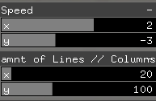
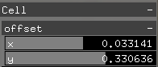
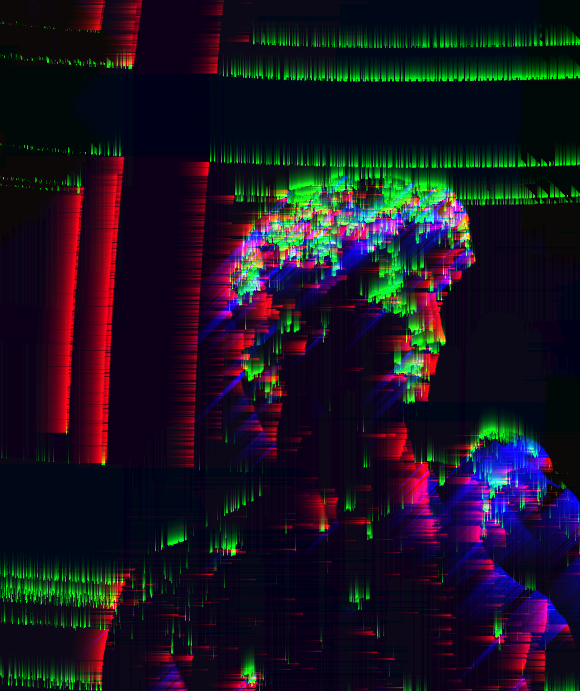

# ofxShaderGltich
Glitch Shader generator In [Openframeworks](https://openframeworks.cc).

   The goal is to easily create glitch effects in OF // use this as a starting point to customise glitch effects.
 It uses a set of masks, and image processing effects to create glitchy effects.
  
 The result is a mix of effects applied to an image / Fbo, which is my take on how to create glitchy effects for real time use.
 

- - - -

- - - -
## Getting Started
### Installs

### 1)Installing OpenFrameworks

Get the latest OpenFrameworks version from [here](https://openframeworks.cc/download)(0.11.0).
 

### 2) Installing

Add this repository to your addons folder, or to the local_addons folder.
 
If using the local_addons folder, make sure the pre processing `#define LOCALADDON`  is **present** in the `constants.h` and in `main.frag`.
 
If using the addons folder, make sure the pre processing `#define LOCALADDON`  is **commented** in the `constants.h` and in `main.frag`.

 
The only dependecy is [ofxAutoReloadedShader](https://github.com/andreasmuller/ofxAutoReloadedShader) from [Andreas Muller](https://github.com/andreasmuller), used to reload shader on the fly to help compiling only shaders.
 

 
The addon works by treating the texture the way OF does it : rectangular textures processed from 0 -> size of the texture in OF, rather than normalised textures coordinates.
 

## Example

Just try running [the example](./example).

Press `g` to show/hidde the gui.
Press `i` to change the type of input - webcam or image.
There is 2 main sections in the gui :  `Type of Tyling` and `Type of Effect`.

## Effects
The glitches are created with 2 sections : tiling and effects.
The tiling create patterns on which to apply the effects.

There is 10 tiles and 10 effects.

### Tiling :
1 - > 4 : divisions on screen controlled by the  . 
4 : sections are controlled by the `Cell -> offset x//y ` :  
5 - > 9 : patterns generation  - parameters to control are : `Mask Layers` for tyling 5, `thresholdNoise` for tyling 6, `continuous` for 7->9. 
`Speed.y` is controlling the speed of the effects for tyling 5 -> 9. 
`RectangleSize` controls the gradiant rect boundaries, and gradiantColor controls its color. 

10 : makes the effect apply to the whole screen.
 
Tyling is processed in the main.frag by setting up the `prop` variable.

### Effects :
0 : **glitch** 
1 : **texture Shift** - works best withj tyling 7. 
2 : **texture shift prop** - shift on texture proportional to prop. Works best with tyling 8. 
3 : **lateral shift** : shift the texture horizontally following the `amnt of lines // columns`, to change the direction to horizontal, change the last argument of `lateralSlider` to `true`.  
4 : **shift with noise per cell** direction change controlled by `continuous`.
5 & 6 : **grad center + inner flip coords** - rect boundaries are controlled by the `rectangle size`, and the amount of sections by `amnt of lines // columns`. The functions `texFlipV` in main.frag are used here, with the last 2 arguments adding a flip on the section coordinate, and a gradiant on the rectangle ( in this case true and true, therefore grad + flip is processed on the image). 

7 : **bright lines** sections of lines of different colors. the first argument gives the direction of the lines - in this case y -. The parameter `continuous` de activates the thresholding on gb, if `ON`, which makes it go less flashy. The `Mask Layers` control the amount of colors layers added. Works best with 2 layers.  
8 : **background color** // invert background color - outside pattern detection.  
9 : **gradiant color** controlled by `rectangle size` and `gradiant color`, and `alphaGradiant`. 
10 : **gradiant color + invert** same as above with inverted color for inner rectangle section.  

 

- - - -

`Feedback` is used to create a feedback on the edges used in the edge detection:

 
This technic uses the strength and angle from the [Cannny Edge detection](https://towardsdatascience.com/canny-edge-detection-step-by-step-in-python-computer-vision-b49c3a2d8123) seperatly implemented [here](https://github.com/pierrextardif/ofxEdgeCannyDetector), and returns an intensity of the edges which is processed in a feedback shader to get a trailing effect. works best with the webcam.
The feedback turns the effects and tilying to -1, as to not interfer with the rest of the shader.
There is also an Edge detection function (not used) which works with key `c` to control the non Maximum of the edge detection and continuity of the pixels value when in between threshold values by checking the neighboors values, when the `nonMaxAndContinuity` is turned `ON` ( initialised `OFF`).

## Author

* _pierre Tardif_   [codingcoolsh.it](codingcoolsh.it)   :floppy_disk:

## License

This project is licensed under the MIT License - see the [LICENSE.md](./LICENSE) file for details.

## Acknowledgments

* [Three.js inspiration](https://threejs.org/examples/?q=glitch#webgl_postprocessing_glitch)
* [squarepusher inspiration](https://www.youtube.com/watch?v=GlhV-OKHecI)
